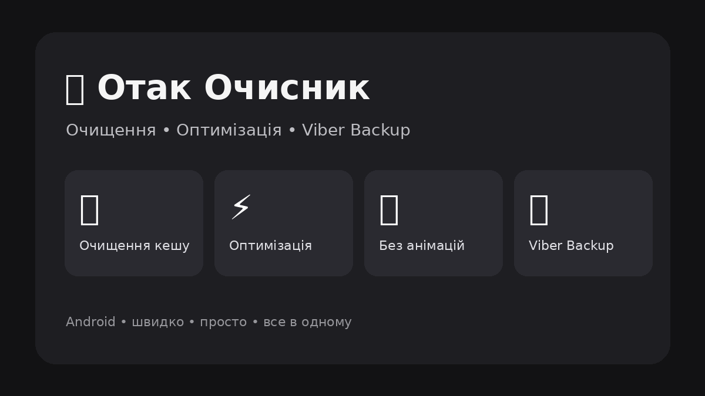

# 🧹 Отак Очисник



**Отак Очисник** — Android-застосунок для швидкого очищення, оптимізації та підготовки смартфона до роботи. Звільняйте зайву памʼять і виконуйте основні дії з обслуговування пристрою в одному місці — без зайвих кроків і втрати часу.

## ⚡ Можливості

- 🧹 **Очищення кешу** — допомагає звільнити зайву памʼять і повернути місце для важливих файлів та застосунків.
- 🚀 **Оптимізація** — швидке очищення й підготовка системи до подальшої роботи.
- 🎬 **Без анімацій** — вимкнення зайвих системних анімацій для швидшої взаємодії зі смартфоном.
- 💾 **Viber Backup** — резервне копіювання даних Viber для зручнішої підготовки до перенесення.
- 📲 **Перенесення даних** — підготовка файлів до переходу на інший телефон.
- 📊 **Статистика** — наочний результат очищення та інформація про звільнене місце.

## 🔥 Все в одному

```text
Перевірка → Очищення → Оптимізація → Готово
```

Виконуйте ключові дії швидше та зручніше: перевірте стан смартфона, очистьте кеш, звільніть памʼять і підготуйте пристрій до роботи в одному застосунку.

## 📱 Платформа

**Android**

> 🚧 Проєкт активно розробляється.
